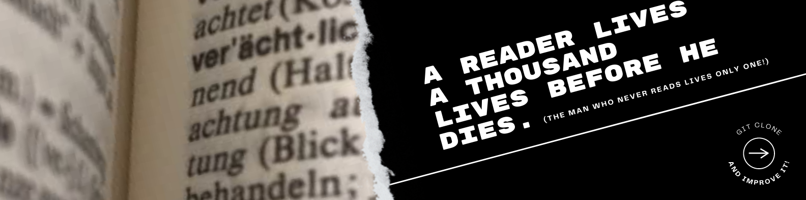

# Booklist
## Website + API



__Made with:__
Website: HTML, CSS & JS
API: _coming soon!_

__What is this?__
Website _(and soon an API of a booklist!)_

__Description:__
Website of the books that I'm reading, read and will read throughout this life :)

__Figma:__
<a href="https://www.figma.com/file/M5TEV0H8k5hXhBF2rj7fBF/Github---Booklist?node-id=0%3A1">Taaaaake on me</a>, take me on!
(seriously, click take on me)

__Behance:__
_Coming soon!_


# Quick links &#128150;
  
[PROJECT SETUP](#Project-setup) &diams; [PREVIEW](#Preview) &diams; [STATUS OF THE PROJECT](#How-is-the-development-of-the-project-right-now) &diams; [CREDITS](#Credits) &diams; [BACK TO TOP](#Website-2021-book-list)


# Project setup
```
Open index.html in your favorite browser :)
```


# Preview


# How is the development of the project right now?
__Last update:__  03/01/2022

I stopped to code this and now I finished a new figma for this project. So...

Soon may the Wellerman come
To bring us sugar and tea and rum
One day, when the tonguing is done
We'll take our leave and go!

Just kidding guys, I'll code this soon _(perhaps)_.


# Credits

I made the banner with Canva, and the rest of the images are from <a href="https://www.freepik.com/">Freepik</a>.
And here are the credits:

<a href="https://www.freepik.com/premium-photo/reading-book-education-learning-reading-concept_2801822.htm">Reading book</a>

__Thank you for your support!__
_... And stay awesome Gothan!_
  
[PROJECT SETUP](#Project-setup) &diams; [PREVIEW](#Preview) &diams; [STATUS OF THE PROJECT](#How-is-the-development-of-the-project-right-now) &diams; [CREDITS](#Credits) &diams; [BACK TO TOP](#Website-2021-book-list)
