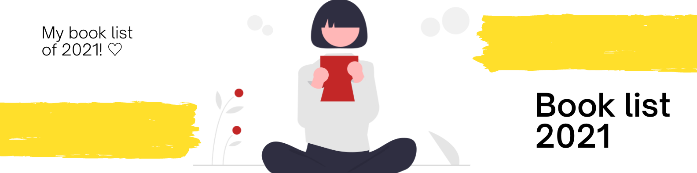

# Website: 2021 book list

<b>Made with:</b><br/>
HTML, CSS, JS
<br/><br/>
<b>What is this?</b><br/>
Website
<br/><br/>
<b>Description:</b><br/>
A website of my 2021 book list :)
<br/><br/>
# Quick links &#128150;
  
[PROJECT SETUP](#Project-setup) &diams; [PREVIEW](#Preview) &diams; [STATUS OF THE PROJECT](#How-is-the-development-of-the-project-right-now) &diams; [CREDITS](#Credits) &diams; [BACK TO TOP](#Website-2021-book-list)


# Project setup
```
Type the commands here
```

### Compiles and hot-reloads for development
```
Type the commands here
```

<b>Thank you for your support!</b>

# Preview


# How is the development of the project right now?
<b>Last update:</b> 09/03/2021

I just have the ideia, I don't know what to do yet hahaha

<br/>

# Credits

The banner img was a composition of a canva banner and this img here:
<a href="https://undraw.co/illustrations">undraw illustration</a>.

<i>Stay awesome Gothan!</i>
  
[PROJECT SETUP](#Project-setup) &diams; [PREVIEW](#Preview) &diams; [STATUS OF THE PROJECT](#How-is-the-development-of-the-project-right-now) &diams; [CREDITS](#Credits) &diams; [BACK TO TOP](#Website-2021-book-list)
